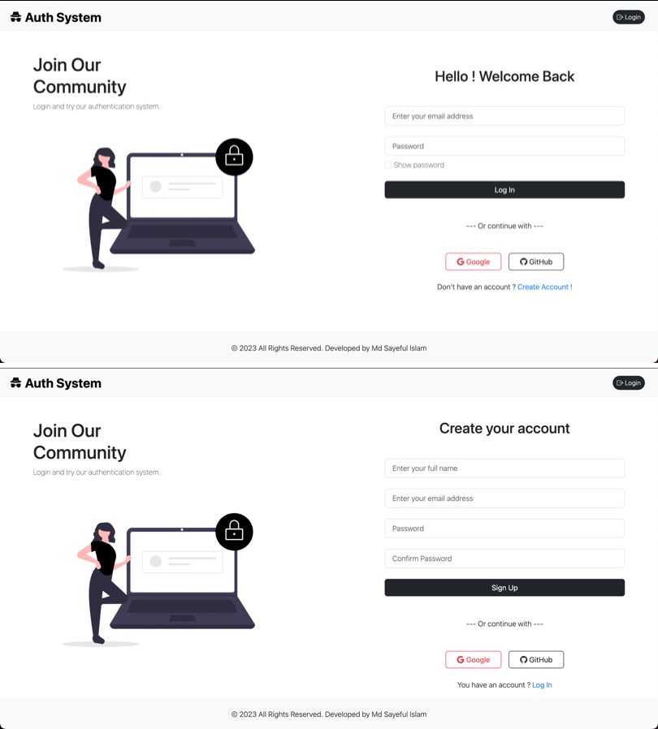
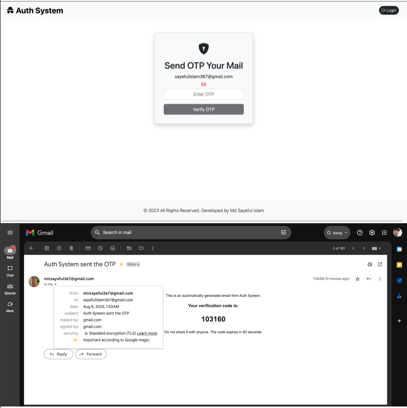
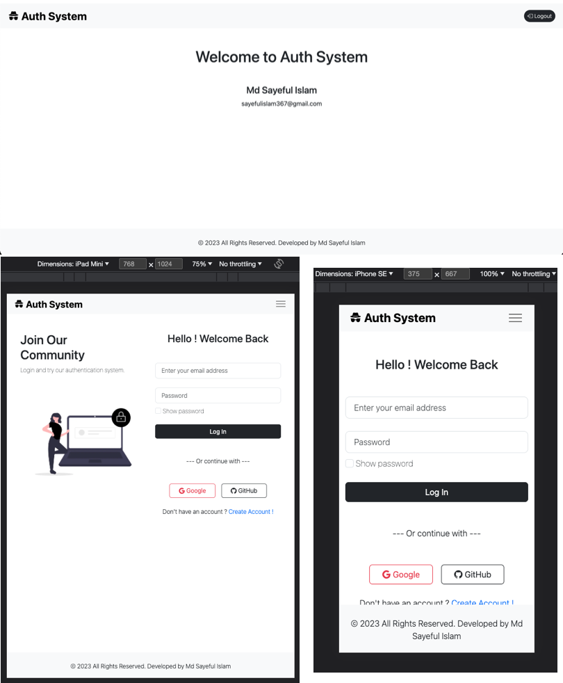

This is a responsive nextJs-auth-system web app. Build an email and password authentication system with NextAuth.js and MongoDB.

This web app using dependencies are:
```bash
"axios": "^1.4.0",
"bootstrap": "^5.3.1",
"bootstrap-icons": "^1.10.5",
"mongoose": "^7.4.2",
"bcryptjs": "^2.4.3",
"next-auth": "^4.22.4",
"nodemailer": "^6.9.4",
```

Application functionality are:
- LogIn
- SignUp
- Save hash password
- Send Email OTP
- Google and GitHub SignIn
- Cookies, Session Storage, Local Storage set the NextAuth
- Backend server using NextJs API Routes
- Loading indicator
- responsive large, laptop, tablet, mobile screen.

## Getting Started
1. Save all this .env file:
```bash
# add your google account_id and google_secret
GOOGLE_ID= 
GOOGLE_SECRET= 
# add your github account_id and github_secret
GITHUB_ID=
GITHUB_SECRET=
# add your gmail id or account App passwords generate
EMAIL=
EMAIL_PASS=
# mongodb link
MONGO_LOCAL=mongodb://127.0.0.1:27017/nextjsAuthSystem
# local url
NEXTAUTH_URL=http://localhost:3000
#Generate Random Passwords via Command Line type cmd= openssl rand -base64 32
AUTH_SECRET=
```

2. First download the code and run:
```bash
npm install
```

3. Start mongodb server.

4. Run the development server:
```bash
npm run dev
# or
yarn dev
# or
pnpm dev
```

Open [http://localhost:3000](http://localhost:3000) with your browser to see the result.

## NextJs-Auth-System app view



